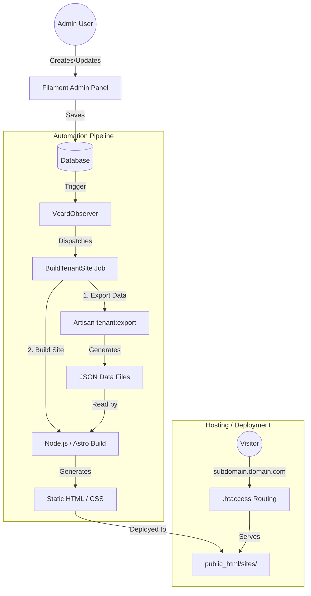

# EcardModern SaaS Platform

Platform for generating high-performance digital business cards using Laravel (Backend) and Astro (Static Frontend).

## 📋 Prerequisites

-   **Server**: Linux (Ubuntu/CentOS) or CPanel Shared Hosting.
-   **PHP**: 8.2 or higher.
-   **Database**: PostgreSQL or MySQL.
-   **Node.js**: v20+ (Required for building static sites).
-   **NVM**: Highly recommended for managing Node versions.
-   **Composer**: v2+.

## 🏗 Architecture



---

## 🚀 Installation Guide

### 1. Backend Setup (Laravel)

```bash
# Clone the repository
git clone <repo-url> ecard-modern
cd ecard-modern

# Install PHP dependencies
composer install --optimize-autoloader --no-dev

# Environment Configuration
cp .env.example .env
# Edit .env and configure DB_*, APP_URL, etc.
nano .env

# Generate Key
php artisan key:generate

# Run Migrations (Seeders create default roles/plans)
php artisan migrate --seed

# Link Storage
php artisan storage:link
```

### 2. Frontend Setup (Astro Generator)

The static site generator lives in the `frontend-generator` directory.

```bash
# Navigate to frontend directory
cd frontend-generator

# Ensure correct Node version (if using NVM)
nvm use

# Install Node dependencies
npm install
```

### 3. Server Configuration

#### Node.js Environment
Ensure the user running Laravel (e.g., `www-data` or your CPanel user) has access to `node` and `npm`.
If using **NVM**, the build script (`app/Jobs/BuildTenantSite.php`) attempts to source it from `~/.nvm/nvm.sh`.

#### File System Permissions
Ensure web server has write access to:
-   `storage/`
-   `bootstrap/cache/`
-   `public_html/sites/` (Where static sites are deployed)
-   `frontend-generator/dist/` (Temporary build output)

#### Queues & Cron
For the "Rebuild" feature to work, you must run the queue worker.

**Local/VPS:**
Make sure to start the development server:
```bash
php artisan serve
```

And in a separate terminal, run the queue worker:
```bash
php artisan queue:work
```

**CPanel/Shared Hosting:**
Add this to your Cron Jobs (run every minute):
```bash
* * * * * cd /path/to/ecard-modern && php artisan schedule:run >> /dev/null 2>&1
```
And ensure Laravel's scheduler handles the queue (modify `routes/console.php` or `Kernal.php` if needed) or set up a specific cron for `queue:work --stop-when-empty`.

#### Subdomain Routing (.htaccess)
The `public/.htaccess` file is pre-configured to route subdomains (e.g., `juan.ecard.com`) to `public_html/sites/juan/index.html` invisible to the user.

---

## 🛠 Usage

### Creating a Tenant
1.  Log in to the Filament Admin Panel (`/admin`).
2.  Go to **VCards** > **Create**.
3.  Fill in the **Wizard**:
    *   **Slug**: The subdomain (e.g., `juan`).
    *   **Theme**: Select colors and fonts.
    *   **Modules**: Toggle Services, Portfolio, etc.
4.  Click **Create**.
    *   This triggers the `BuildTenantSite` job automatically.
    *   Wait ~10-20 seconds.

### Manual Rebuild
If you need to regenerate a site without changing data:
1.  Go to **VCards** list.
2.  Click the **Rebuild** (Refresh icon) button on the tenant row.
3.  Or use the CLI:
    ```bash
    node build-tenant.cjs <slug>
    ```

---

## 📂 Project Structure

-   `app/Filament`: Admin Panel resources (Wizards, Forms).
-   `app/Services/AstroDataGenerator.php`: Logic to transform DB data to JSON.
-   `app/Jobs/BuildTenantSite.php`: Queueable job that runs the build script.
-   `storage/app/private/astro-data/`: JSON files generated for Astro.
-   `frontend-generator/`: Astro project source code.
    -   `src/pages/[slug].astro`: Dynamic route handler.
    -   `src/components/`: Reusable modules (Portfolio, Contact, etc.).
-   `public_html/sites/`: Final HTML output for each tenant.

## 🐛 Troubleshooting

**Build fails with "Command not found":**
Check `app/Jobs/BuildTenantSite.php` and verify the path to `nvm.sh` or `node`.

**Site gives 404:**
Check `public_html/sites/<slug>/index.html` exists. If yes, check `.htaccess` rules.
